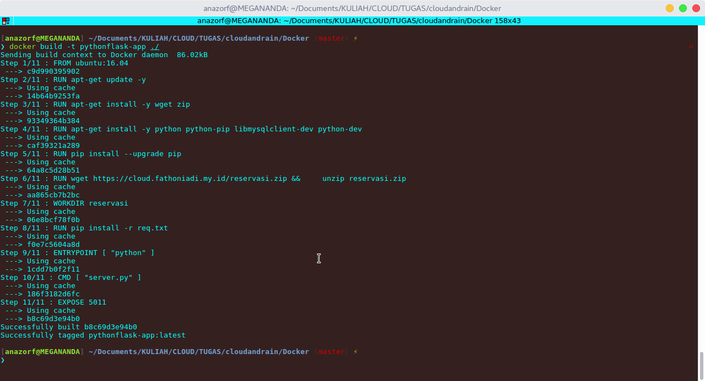
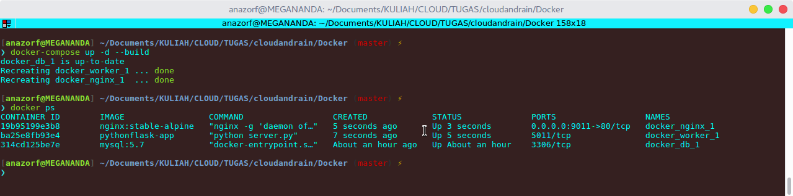
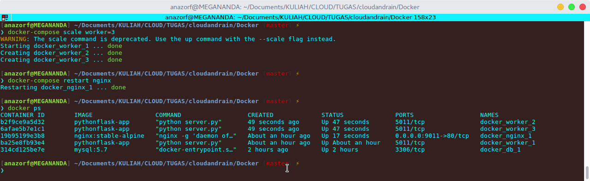
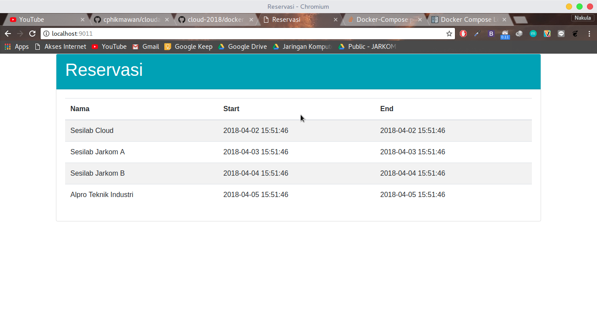

## Tugas Docker

### Anggota Kelompok :

##### 1. Fuad Dary Rosyadi (Dr. Fu) - 05111540000089   
##### 2. Cahya Putra Hikmawan (Cloud) - 05111540000119

### Penyelesaian Tugas Docker

##### No. 1
- Step 1 - Buat direktori baru untuk Docker
```
    mkdir Docker
```
- Step 2 - Buat **Dockerfile** dan edit untuk image soal 1
```
    nano Dockerfile
```
- Step 3 - Berikut isi dari **Dockerfile**
```
    FROM ubuntu:16.04

    RUN apt-get update -y
    RUN apt-get install -y wget zip
    RUN apt-get install -y python python-pip libmysqlclient-dev python-dev
    RUN pip install --upgrade pip

    RUN wget https://cloud.fathoniadi.my.id/reservasi.zip && unzip reservasi.zip

    WORKDIR reservasi
    RUN pip install -r req.txt
    ENTRYPOINT [ "python" ]
    CMD [ "server.py" ]

    EXPOSE 5011
```
- Step 4 - Buat image pada docker
```
    docker build -t pythonflask-app ./
```


##### No. 2 - No. 3 - No. 4
- Step 1 - Buat dan edit **docker-compose.yml**
```
    nano docker-compose.yml
```

```
    version: '3.6'
    services:
        db:
            image: mysql:5.7
            volumes:
                - ./reservasi:/docker-entrypoint-initdb.d
                - dbdata:/var/lib/mysql
            restart: always
            environment:
                MYSQL_ROOT_PASSWORD: buayakecil
                MYSQL_DATABASE: reservasi
                MYSQL_USER: userawan
                MYSQL_PASSWORD: buayakecil

        worker:
            image: pythonflask-app
            depends_on:
                - db
            environment:
                DB_HOST: db
                DB_USERNAME: userawan
                DB_PASSWORD: buayakecil
                DB_NAME: reservasi

        nginx:
            image: nginx:stable-alpine
            ports:
                - 9011:80
            depends_on:
                - worker
            volumes:
                - ./nginx.conf:/etc/nginx/conf.d/default.conf:ro
    volumes:
        dbdata:
```



- **Keterangan :**
##### Nomer 2
1. Worker - Menggunakan Image pada soal nomer 1
2. Worker - Pada untuk mengerjakan soal nomer 2 akan menggunakan docker-compose load balancing dan scaling.

- Step 1 - Buat scale untuk worker ke 2 dan ke 3, keterangan worker=3 karena akan membuat 3 worker
```
    docker-compose scale worker=3
```
- Step 2 - Restart nginx pada container
```
    docker-compose restart nginx
```
- Step 3 - Mengecek apakah worker 2 dan 3 sudah berjalan
```
    docker ps
```



##### Nomer 3
1. Nginx - Menggunakan image container dari Docker Hub -> nginx:stable-alpine
2. Nginx - untuk nginx.conf akan disimpan pada **/etc/nginx/conf.d/default.conf:ro** di container

- Konfigurasi untuk **nginx.conf** sebagai berikut :
```
    server {
        listen  80 default_server;
        location / {
            proxy_pass http://worker:80;
        }
    }
```

##### Nomer 4
1. DB - Menggunakan image container dari Docker Hub -> mysql:5.7
2. DB - Pada Volume mengunakan **./reservasi:/docker-entrypoint-initdb.d** yang akan membaca seluruh isi direktori yang berformat .sql sekaligus import dan disimpan pada **dbdata** yang ada di dalam direktori **/var/lib/mysql** dan **restart: always** sehingga volume storage mysql persisten kecuali ketika mengetikkan command *`docker-compose down -v`*

- Tampilan Website ketika mengakses ***localhost:9011***

