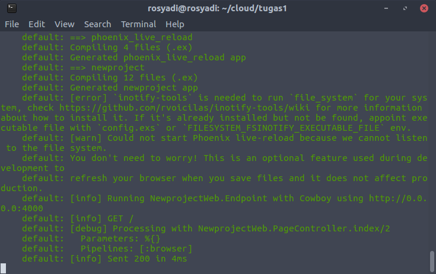

## Dokumentasi Tugas

## Created By Cloud and Dr. Fu

### Kebutuhan
- Virtual Box
- Vagrant
- VM Box Ubuntu 16.04 Xenial 64bit 

### Membuat VM Ubuntu 16.04 Xenial
1. Download box xenial

	 	wget https://vagrantcloud.com/ubuntu/boxes/xenial64/versions/20180309.0.0/providers/virtualbox.box

2. Addbox dengan cara

	**vagrant box add (nama_box_terserah) (box_hasil_download)**

		vagrant box add ubuntu/xenial64 xenial-server-cloudimg-amd64-vagrant.box

3. Edit Box, kemudian `vagrant up`

		config.vm.box = "ubuntu/xenial64"

#### 0. Provisioning dilakukan dengan cara menggunakan file [bootstrap](https://github.com/cphikmawan/cloudandrain/blob/master/bootstrap.sh)

Setting pada vagrant file :

    config.vm.provision :shell, path: "bootstrap.sh" 

Reload

		vagrant reload --provision

#### 1. Buat vagrant virtualbox dan buat user 'awan' dengan password 'buayakecil'.

**Jawab** :

```bash
# this is how to create user
sudo useradd awan
echo -e "buayakecil\nbuayakecil" | sudo passwd awan
```


Coba login


#### 2. Buat vagrant virtualbox dan lakukan provisioning install Phoenix Web Framework

**Jawab** :

```bash
#!/usr/bin/env bash
#this is how to install phoenix web framework by using shell script

#update and install elixir
sudo apt-get update
sudo apt-get install -y elixir

#use mix to install hex
echo y | mix local.hex

#download and add the Erlang Repository to server
wget https://packages.erlang-solutions.com/erlang-solutions_1.0_all.deb && sudo dpkg -i erlang-solutions_1.0_all.deb

#update and install Erlang
sudo apt-get update
sudo apt-get install -y esl-erlang

#install Phoenix archive
echo y | mix archive.install https://github.com/phoenixframework/archives/raw/master/phx_new.ez

#make project directory
mkdir phoenix
echo y | sudo mix phx.new --no-ecto --no-brunch phoenix

#run server
cd phoenix
echo y | sudo mix deps.get
echo y | sudo mix phx.server
	
```

**Hasil instalasi Vagrant Provision**



**Akses IP vagrant pada browser dengan port 4000**


#### 3. Buat vagrant virtualbox dan lakukan provisioning install:

- php
- mysql
- composer
- nginx

    setelah melakukan provioning, clone https://github.com/fathoniadi/pelatihan-laravel.git pada folder yang sama dengan vagrantfile di komputer host. Setelah itu sinkronisasi folder pelatihan-laravel host ke vagrant ke /var/www/web dan jangan lupa install vendor laravel agar dapat dijalankan. Setelah itu setting root document nginx ke /var/www/web. webserver VM harus dapat diakses pada port 8080 komputer host dan mysql pada vm dapat diakses pada port 6969 komputer host.

**Jawab** :

```bash
# this is how to install php
sudo apt-get -y update
sudo apt-get install -y software-properties-common build-essential
sudo add-apt-repository ppa:ondrej/php
sudo apt-get -y update
sudo apt-get install -y php7.1 php7.1-cli php7.1-common php7.1-json php7.1-opcache php7.1-mysql php7.1-mbstring php7.1-mcrypt php7.1-zip php7.1-fpm

# this is how to install mysql
debconf-set-selections <<< 'mysql-server mysql-server/root_password password vagrant'
debconf-set-selections <<< 'mysql-server mysql-server/root_password_again password vagrant'
sudo apt-get -y update
apt-get install -y mysql-server
apt-get install -y mysql-client

# this is how to install php
php -r "copy('https://getcomposer.org/installer', 'composer-setup.php');"
php -r "if (hash_file('SHA384', 'composer-setup.php') === '544e09ee996cdf60ece3804abc52599c22b1f40f4323403c44d44fdfdd586475ca9813a858088ffbc1f233e9b180f061') { echo 'Installer verified'; } else { echo 'Installer corrupt'; unlink('composer-setup.php'); } echo PHP_EOL;"
php composer-setup.php
php -r "unlink('composer-setup.php');"
mv composer.phar /usr/local/bin/composer

# this is how to install nginx
sudo apt-get -y update
sudo apt-get -y install nginx
sudo service nginx start
```

Imajinasi :

**STEP 1** -  Clone file laravel

    git clone https://github.com/fathoniadi/pelatihan-laravel.git
    cd pelatihan-laravel
    cp .env-example .env
    sudo composer update
    php artisan key:generate
    php artisan migrate
    php artisan db:seed

**STEP 2** - Sinkronisasi folder host dengan VM

    config.vm.synced_folder "pelatihan-laravel/", "/var/www/web", id: "vagrant-root",
        owner: "vagrant", //untuk menentukan siapa ownernya atau chown
        group: "www-data", //untuk menentukan grupnya atau chown
        mount_options: ["dmode=775,fmode=664"] //menentukan hak akses atau chmod

**STEP 3** - Port Forwarder

    //webserver
    config.vm.network "forwarded_port", guest: 80, host: 8080
    //mysql server
    config.vm.network "forwarded_port", guest: 3306, host: 6969

**STEP 4** - Edit konfigurasi nginx di **/etc/nginx/site-available/default**

    sudo nano /etc/nginx/site-available/default

Seperti konfig di bawah ini.

```conf
##
# You should look at the following URL's in order to grasp a solid understanding
# of Nginx configuration files in order to fully unleash the power of Nginx.
# http://wiki.nginx.org/Pitfalls
# http://wiki.nginx.org/QuickStart
# http://wiki.nginx.org/Configuration
#
# Generally, you will want to move this file somewhere, and start with a clean
# file but keep this around for reference. Or just disable in sites-enabled.
#
# Please see /usr/share/doc/nginx-doc/examples/ for more detailed examples.
##

# Default server configuration
#
server {
	listen 80 default_server;
	listen [::]:80 default_server;

	# SSL configuration
	#
	# listen 443 ssl default_server;
	# listen [::]:443 ssl default_server;
	#
	# Note: You should disable gzip for SSL traffic.
	# See: https://bugs.debian.org/773332
	#
	# Read up on ssl_ciphers to ensure a secure configuration.
	# See: https://bugs.debian.org/765782
	#
	# Self signed certs generated by the ssl-cert package
	# Don't use them in a production server!
	#
	# include snippets/snakeoil.conf;

	root /var/www/web/public;

	# Add index.php to the list if you are using PHP
	index index.php index.html index.htm index.nginx-debian.html;
	error_log  /var/log/nginx/nginx_error.log  warn;
	server_name _;

	location / {
		# First attempt to serve request as file, then
		# as directory, then fall back to displaying a 404.
		try_files $uri $uri/ /index.php?$query_string;
	}

	# pass the PHP scripts to FastCGI server listening on 127.0.0.1:9000
	#
	location ~ \.php$ {
		include snippets/fastcgi-php.conf;
	#
	#	# With php7.0-cgi alone:
	#	fastcgi_pass 127.0.0.1:9000;
	#	# With php7.0-fpm:
		fastcgi_pass unix:/var/run/php/php7.1-fpm.sock;
	}

	# deny access to .htaccess files, if Apache's document root
	# concurs with nginx's one
	#
	location ~ /\.ht {
		deny all;
	}
}


# Virtual Host configuration for example.com
#
# You can move that to a different file under sites-available/ and symlink that
# to sites-enabled/ to enable it.
#
#server {
#	listen 80;
#	listen [::]:80;
#
#	server_name example.com;
#
#	root /var/www/example.com;
#	index index.html;
#
#	location / {
#		try_files $uri $uri/ =404;
#	}
#}

```

Kemudian **restart**

    sudo service nginx restart

**STEP 5** - Edit konfigurasi file mysql di **/etc/mysql/my.cnf**

    sudo nano /etc/mysql/my.cnf

```conf
#
# The MySQL database server configuration file.
#
# You can copy this to one of:
# - "/etc/mysql/my.cnf" to set global options,
# - "~/.my.cnf" to set user-specific options.
# 
# One can use all long options that the program supports.
# Run program with --help to get a list of available options and with
# --print-defaults to see which it would actually understand and use.
#
# For explanations see
# http://dev.mysql.com/doc/mysql/en/server-system-variables.html

# This will be passed to all mysql clients
# It has been reported that passwords should be enclosed with ticks/quotes
# escpecially if they contain "#" chars...
# Remember to edit /etc/mysql/debian.cnf when changing the socket location.

# Here is entries for some specific programs
# The following values assume you have at least 32M ram

[mysqld_safe]
socket		= /var/run/mysqld/mysqld.sock
nice		= 0

[mysqld]
#
# * Basic Settings
#
user		= mysql
pid-file	= /var/run/mysqld/mysqld.pid
socket		= /var/run/mysqld/mysqld.sock
port		= 3306
basedir		= /usr
datadir		= /var/lib/mysql
tmpdir		= /tmp
lc-messages-dir	= /usr/share/mysql
# skip-external-locking
#
# Instead of skip-networking the default is now to listen only on
# localhost which is more compatible and is not less secure.
bind-address	= 0.0.0.0
#
# * Fine Tuning
#
key_buffer_size		= 16M
max_allowed_packet	= 16M
thread_stack		= 192K
thread_cache_size       = 8
# This replaces the startup script and checks MyISAM tables if needed
# the first time they are touched
myisam-recover-options  = BACKUP
#max_connections        = 100
#table_cache            = 64
#thread_concurrency     = 10
#
# * Query Cache Configuration
#
query_cache_limit	= 1M
query_cache_size        = 16M
#
# * Logging and Replication
#
# Both location gets rotated by the cronjob.
# Be aware that this log type is a performance killer.
# As of 5.1 you can enable the log at runtime!
#general_log_file        = /var/log/mysql/mysql.log
#general_log             = 1
#
# Error log - should be very few entries.
#
log_error = /var/log/mysql/error.log
#
# Here you can see queries with especially long duration
#log_slow_queries	= /var/log/mysql/mysql-slow.log
#long_query_time = 2
#log-queries-not-using-indexes
#
# The following can be used as easy to replay backup logs or for replication.
# note: if you are setting up a replication slave, see README.Debian about
#       other settings you may need to change.
#server-id		= 1
#log_bin			= /var/log/mysql/mysql-bin.log
expire_logs_days	= 10
max_binlog_size   = 100M
#binlog_do_db		= include_database_name
#binlog_ignore_db	= include_database_name
#
# * InnoDB
#
# InnoDB is enabled by default with a 10MB datafile in /var/lib/mysql/.
# Read the manual for more InnoDB related options. There are many!
#
# * Security Features
#
# Read the manual, too, if you want chroot!
# chroot = /var/lib/mysql/
#
# For generating SSL certificates I recommend the OpenSSL GUI "tinyca".
#
# ssl-ca=/etc/mysql/cacert.pem
# ssl-cert=/etc/mysql/server-cert.pem
# ssl-key=/etc/mysql/server-key.pem
```

    sudo service mysql restart

**STEP 6** - Grant Privileges agar **host** dapat mengakses mysql pada **VM**

Login mysql pada VM

	mysql -u root -p

- Grant Privileges

		GRANT ALL PRIVILEGES ON *.* TO 'user_yang_perlu_hak_akses'@'ip_host_yang_perlu_hak_akses' INDENTIFIED BY 'password';

- Flush

		FLUSH PRIVILEGES;

**STEP 7** - Testing

1. Web Server bisa diakses pada port 8080
    
    Ketikkan `localhost:8080` di browser. Kebetulan karena projectnya gagal maka muncul undefine variable :'). Maaf Thon :)


2. Mysql bisa diakses pada port 6969

    Ketikkan pada terminal

        mysql -u root -p -h (ip_masing-masing) -P 6969


#### 4. Buat vagrant virtualbox dan lakukan provisioning install:

- Squid proxy
- Bind9

**Jawab** :

```bash
#!/usr/bin/env bash
#this is how to install squid3 and bind9

sudo apt-get update
sudo apt-get install -y squid3
sudo apt-get install -y bind9
```

**Hasil instalasi squid pada vagrant provision** 


**Hasil instalasi bind pada vagrant provision**


**Services status bind & squid pada vagrant ssh**


## Selesai

- Cahya Putra Hikmawan (Cloud) - 05111540000119
- Fuad Dary Rosyadi (Dr. Fu) - 05111540000089
